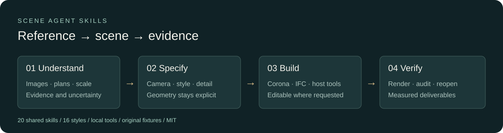

# Scene Agent Skills

**Free architectural skills for Codex and Claude: match cameras, explore 16 render styles, prepare Corona scenes and turn structured plans into IFC models.**

[English](README.md) · [Русский](README.ru.md) · [Get started](docs/installation.md) · [16 styles](docs/style-catalogue.md) · [20 skills](docs/skills.md) · [Test results](docs/verification.md)



Give your agent a reusable architectural workflow. **Scene Agent Skills** brings together 20 skills, executable tools and original examples for architects and visualizers working with **Codex, including Astra, and Claude Code**.

Choose a visual direction, preserve the building and camera, set the right level of detail, and carry the work through materials, lighting and delivery. Use the included scripts for repeatable preparation and your connected 3D or image tools to create the final result.

**Free under MIT, including commercial use under the licence terms.** Start with a single skill or install the complete bundle in your project.

## What you get

| Area | Included |
|---|---|
| Agent skills | 20 shared skills, Codex metadata, Claude plugin and project installers |
| Art direction | 16 style recipes with material, lighting, camera, finishing and review guidance |
| Modeling | Low / high / very-high detail profiles with screen-space targets and topology workflows |
| Camera | Numerical 3D/2D landmark fit, independent holdout errors and Corona camera transfer |
| Atmosphere | 8 lighting recipes: daylight, overcast, golden hour, blue hour, night, rain, interior and clay |
| 3ds Max + Corona | Quick MAXScript commands for quality, Physical Materials, glass, displacement, area lights, LightMix and mesh inventory |
| Plan → BIM | Validated JSON → IFC4 walls, slabs, doors, windows and real opening relationships |
| Archicad | IFC import/roundtrip procedure and official Python read-only inventory bridge |
| Delivery | Image decoding checks, relative-path SHA-256 inventory and dependency ZIP packaging |
| Developer tools | Optional six-tool MCP server, tests, CI, original fixtures and platform architecture notes |

## Start in a few commands

Python 3.11+ is required for the executable tools. Skills can be read without installing Python.

```sh
git clone https://github.com/prorenderbureau/scene-agent-skills.git
cd scene-agent-skills
python -m venv .venv
# Activate .venv for your shell; see installation guide.
python -m pip install -e ".[camera,bim,mcp]"
scene-agent styles
scene-agent plan-check examples/courtyard/plan.json
scene-agent ifc examples/courtyard/plan.json --out outputs/courtyard.ifc
scene-agent corona --quality preview --out outputs/corona-preview.ms
```

These commands give you an IFC model, a Corona setup script and a catalogue of style recipes. Run the generated MAXScript in 3ds Max; apply style recipes with your connected image or 3D tools. Use a new output filename for each version to preserve earlier results.

Install the skill bundle into an **existing project folder**:

```sh
python tools/install_skills.py --agent both --project /path/to/your-project --dry-run
python tools/install_skills.py --agent both --project /path/to/your-project
```

Codex uses `.agents/skills`; Claude uses `.claude/skills`. The installer keeps shared references together, skips identical files and refuses conflicting local edits. [Plugin installation and Windows instructions →](docs/installation.md)

## Use it with an agent

**Codex:**

> Use $scene-toolkit to reconstruct this reference as an editable architectural scene. Use the first image as the hero camera, keep all openings, use high detail, and report measured versus inferred dimensions. Start with a camera blockout and verify a native render before final delivery.

**Claude Code plugin:**

> /scene-agent-skills:scene-plan-to-bim Convert this dimensioned floor plan into a validated plan and IFC. Preserve the scale evidence, create real openings and give me the Archicad import verification steps.

**Style variation:**

> Use $scene-style-transfer to create blue-hour, Japandi and clay-study alternatives. Keep the building geometry and camera fixed. Deliver images, and state which changes are image-only and which exist in the editable scene.

Choose Astra or your preferred supported Claude model in the agent host. Scene creation uses the tools connected to that host; the optional MCP server adds local preparation and file operations. Follow the [installation guide](docs/installation.md) to connect the components for your workflow.

## The 16 styles

**Lighting:** photoreal daylight · blue hour · golden hour · soft overcast · rainy cinematic · architectural night.

**Design:** Scandinavian · Japandi · warm minimalism · tactile brutalism · contemporary Mediterranean · industrial loft · biophilic tropical.

**Presentation:** clay study · watercolor concept · technical axonometric.

Each [style card](docs/style-catalogue.md) gives you material and lighting direction, camera constraints, starting ranges and a review checklist. Watercolor uses an illustration workflow; the other cards describe their image and scene preparation steps.

## Choose your workflow

- **Reference → scene:** analyze dimensions and perspective, match the camera, then build and render in your connected 3D application.
- **Reference → style variations:** choose a style card, lock the architecture and camera, and execute with your image or 3D tools.
- **Plan → BIM:** trace the plan with an agent or operator, validate the structured plan, export IFC and follow the Archicad import procedure.

The [tool and workflow guide](docs/capabilities.md) explains the inputs, outputs and software needed for each route. Use your own renderer licences, model access and project assets alongside the original examples included here.

## Built with reproducible checks

**22 automated tests** passed locally, alongside **15 native checks in 3ds Max 2024 / Corona 15**, including a real technical render. [GitHub checks](https://github.com/prorenderbureau/scene-agent-skills/actions) cover Windows and Linux. The [test report](docs/verification.md) records the environments, fixtures and results.

## Learn and extend

- [Installation and host setup](docs/installation.md)
- [CLI command reference](docs/commands.md)
- [Complete skill index](docs/skills.md)
- [Plan schema and original courtyard example](examples/courtyard/README.md)
- [Camera input and assumptions](skills/scene-toolkit/references/camera.md)
- [Corona quick commands](skills/scene-toolkit/references/corona.md)
- [MCP setup and tool contracts](docs/mcp.md)
- [Testing and reproducible verification](docs/testing.md)
- [Lessons from reconstruction work](docs/lessons-learned.md)
- [Architecture for a future scene platform](docs/platform-architecture.md)
- [Primary documentation sources](docs/sources.md)

Contributions with small, redistributable fixtures are welcome. Read [CONTRIBUTING.md](CONTRIBUTING.md). Code, original examples and documentation are available under [MIT](LICENSE); third-party software and assets retain their own licences.

Maintained by [prorenderbureau](https://github.com/prorenderbureau). Independent community project; not affiliated with OpenAI, Anthropic, Autodesk, Chaos or Graphisoft.
