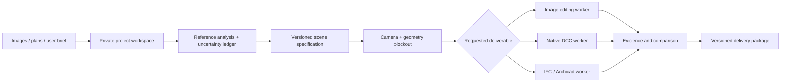

# Architecture for a future scene platform

This document is a proposed next system, **not an implemented web application**. The current repository provides portable workflow instructions, contracts and several deterministic tools that can become worker components.

## Data flow

## Keep three products separate

An image variant preserves visual constraints but may not correspond to editable geometry. A DCC scene must contain objects, materials, lights and cameras that actually render. A BIM model must preserve semantic element types, units, storeys and opening relationships. The API should record the deliverable type explicitly so a cheap image output cannot silently satisfy a native-scene request.

## Core records

- **Project:** owner, access boundary, units, source rights and retention preference.
- **Reference:** hash, dimensions, crop transform, priority, purpose and private storage key.
- **Observation:** region/landmark, measured value, inference, confidence rationale and contradiction links.
- **Scene specification:** coordinate system, geometry IDs, material bindings, camera, lights, quality profiles and unresolved assumptions.
- **Job:** adapter/version, input hashes, finite limits, state, progress heartbeat, checkpoint, cancellation token and output hashes.
- **Evidence:** actual native render, host settings, geometric checks, residuals, warnings and human corrections.

Start with versioned JSON contracts and stable element IDs. Do not bury coordinates, units or tool responses only in chat history. The plan schema in this repository is an intentionally narrow first geometry contract; extend it with migrations and fixtures, not unknown free-form fields.

## Worker boundaries

Each native Max worker should own one process and isolated temporary project. Discover installed Corona capabilities, load an explicit checkpoint, execute allowlisted operations, save a new checkpoint and report real progress. Avoid global scene reset against a user's interactive process. Cancellation terminates only the owned job or requests host cancellation; verify output state after interruption.

An Archicad adapter needs a verified import translator path or a documented add-on command interface. Ordinary Python property queries do not imply arbitrary native element creation. Qualify every supported host version using wall/slab/opening fixtures and native editability plus IFC roundtrip.

Image workers should retain the original and geometry control images, record provider/model/configuration and label output as image-only. A reference image cannot uniquely specify hidden geometry; propagate uncertainty to the scene specification and review interface.

## API sketch

`POST /projects/{id}/references` stores an authorized upload. `POST /projects/{id}/jobs` submits a versioned deliverable request. `GET /jobs/{id}` returns actual worker state; `POST /jobs/{id}/cancel` cancels the owned job. `GET /jobs/{id}/evidence` returns scoped output links and checks. These are design endpoints, not live routes in this release.

Use idempotency keys for job submission, content hashes for cache eligibility and a state machine: queued → preparing → running → verifying → completed, with failed/cancelled alternatives. A prepared MAXScript is a `preparing` artifact, not `completed` native work. Reuse geometry caches only when geometry inputs/versions match; style changes should not invalidate unrelated topology work.

## Evaluation

Maintain separate scores for camera, observed structure, materials, lighting and details. Use non-coplanar camera landmarks with held-out correspondences. Include geometry/section tests that a hero render cannot reveal. Exclude projected background pixels from geometry fidelity. Add private project benchmarks only with consent; public fixtures must be original or redistributable.

## Practical build sequence

1. Harden the existing local tools and add more real projects as private fixtures.
2. Implement a Max worker with job state, checkpoint, cancellation and asset enumeration.
3. Add native Archicad import/create verification with a supported translator/add-on.
4. Introduce tracing/OCR/depth assistance with human-correctable coordinates and uncertainty.
5. Add private web upload/review, variant comparison and scoped artifact downloads.
6. Measure quality/cost on each deliverable class before expanding providers or architectural styles.

For hosted use, add per-tenant OS isolation, resource quotas, upload validation, short-lived access, audit records and explicit retention. The current local path guard is insufficient for a shared cloud worker. Renderer licensing and cloud usage rights need to match the actual deployment model.
