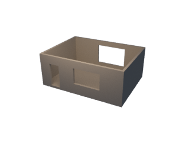

# Verification evidence

Date: **2026-09-11**. Results below describe the supplied fixtures and recorded software environments.

## Portable tools

Tested locally on Windows with Python 3.12, IfcOpenShell 0.8.5, NumPy 2.5.3, SciPy 1.18.1, Pillow 12.3.0 and MCP SDK 1.30.0. The automated suite covers schema and error paths, real IFC geometry, numerical camera recovery, packaging, installer behavior and a real stdio MCP client session.

The local suite passed **22 tests**. All 20 skills passed the available skill validator; the Codex plugin passed its manifest validator. A wheel was built and installed into a separate directory, where its style data and MAXScript resource were read successfully. The Claude manifest layout follows the official contract and passed internal consistency checks.

The initial [GitHub Actions run](https://github.com/prorenderbureau/scene-agent-skills/actions/runs/34625200177) also passed all five jobs: core/camera/MCP on Windows and Linux with Python 3.11 and 3.12, plus IFC on Linux. See [current runs](https://github.com/prorenderbureau/scene-agent-skills/actions) for subsequent changes.

The courtyard south wall has 4.8 m³ gross volume and **3.61 m³ after openings**; the test independently tessellates the IFC wall and checks that volume. IFC units, containment, filling/void relations and elevated placements are checked.

The camera test recovers a synthetic known camera and evaluates four held-out points. A deliberately corrupted held-out point fails the independent check while training error remains small. These results measure recovery on that synthetic fixture.

## Native Corona

Tested in **3ds Max 2024.1**, Corona **15.0.671720**, in an isolated fresh batch process. [Machine-readable report](evidence/native-corona.json).

- All three quality presets applied and were read back.
- Physical material roughness mode and solid glass were checked.
- Signed millimetre displacement bounds converted correctly to scene units.
- Plan blockout created 27 closed, UV-mapped wall/slab cells.
- Camera position/FOV, explicit free-camera/FOV-source mode and host landmark reprojection were checked.
- Maximum host camera reprojection error on the synthetic fixture: approximately **0.000124 px**.
- Existing render elements survived LightMix setup; duplicate SA groups were rejected.
- A real 320 × 240 Corona PNG was produced in approximately 6.9 seconds of measured render-call time.

This low-sample technical render uses original simple geometry to exercise the native pipeline. The recorded LightMix checks cover configuration and preservation of existing render elements. Evaluate AOV image quality, production scene sizes and other Max/Corona versions with their own fixtures.

## Evidence scope and project acceptance

The recorded native runs cover **3ds Max / Corona**. Archicad import/PLN roundtrip and Claude/Codex behavioral routing are outside those recorded runs; bundle validation covers file formats and metadata. Use the [Archicad procedure](../skills/scene-toolkit/references/archicad.md) and [routing cases](../evals/trigger-cases.json) to document acceptance in your own host and model version.

Reconstruction, plan tracing, retopology and vegetation/furniture authoring use the workflows and connected tools described in the [tool guide](capabilities.md). Cloud deployment and render-farm scheduling are covered by the platform design document. Review project output, asset rights and deployment requirements as part of those workflows.

For reproduction see [testing.md](testing.md). For executable components and authoring procedures see [capabilities.md](capabilities.md).
